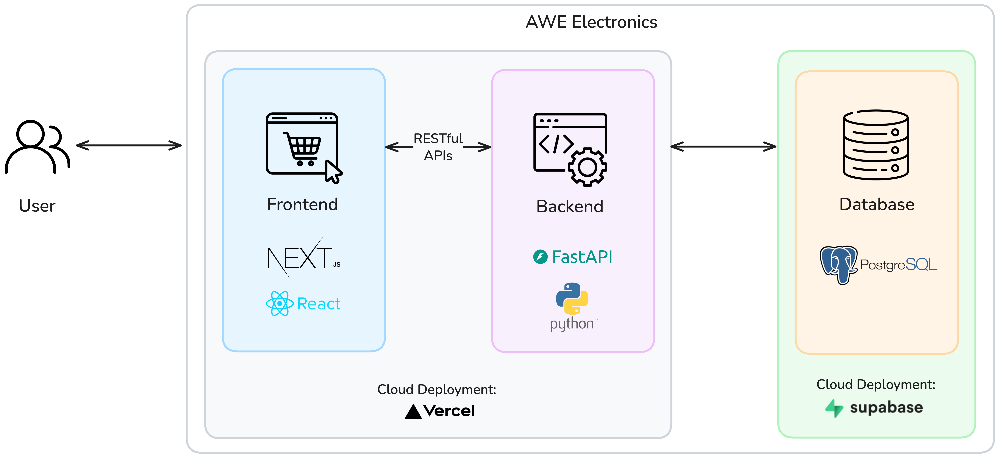

# AWE Electronics Online Store

A full-stack e-commerce platform for electronics retail.

**Available at:** https://awe-electronics.vercel.app

## System Architecture

The web application uses a **3-tier architecture** with RESTful APIs, with the presentation layer (Next.js frontend), business logic layer (FastAPI backend), and data layer (PostgreSQL database).



The application is deployed using cloud platforms:

- **Frontend & Backend:** Deployed on Vercel
- **Database:** Hosted on Supabase

## Technology Stack

- **Next.js 16 (Frontend):** React-based web framework for building user interfaces; uses the modern App Router for file-based routing and server components.
- **FastAPI (Backend):** Python web framework for building REST APIs; provides automatic API documentation and data validation.
- **PostgreSQL (Database):** Relational database management system for persistent data storage; offers ACID compliance and complex query capabilities.
- **SQLAlchemy (ORM):** Object-relational mapping library for database interactions; allows working with database records as Python objects.
- **JWT (Authentication):** Token-based authentication mechanism for API security; enables stateless authentication without server-side sessions.
- **Pytest (Testing):** Python testing framework for automated tests; provides fixtures and plugins for comprehensive backend testing.

## API Endpoints

### Public Endpoints

| Method | Endpoint                   | Description                 |
| ------ | -------------------------- | --------------------------- |
| POST   | `/api/auth/register`       | Register new customer       |
| POST   | `/api/auth/login`          | Login (returns JWT)         |
| GET    | `/api/products`            | Browse products (paginated) |
| GET    | `/api/products/{id}`       | Product details             |
| GET    | `/api/products/categories` | List categories             |
| POST   | `/api/tracking`            | Track order (no auth)       |

### Customer Endpoints (JWT Required)

| Method | Endpoint               | Description          |
| ------ | ---------------------- | -------------------- |
| GET    | `/api/auth/me`         | Current user profile |
| GET    | `/api/cart`            | Get shopping cart    |
| POST   | `/api/cart/items`      | Add to cart          |
| PATCH  | `/api/cart/items/{id}` | Update quantity      |
| DELETE | `/api/cart/items/{id}` | Remove item          |
| POST   | `/api/checkout`        | Complete purchase    |
| GET    | `/api/orders`          | Order history        |
| GET    | `/api/orders/{id}`     | Order details        |

### Staff Endpoints (Staff/Manager Role)

| Method | Endpoint                                   | Description     |
| ------ | ------------------------------------------ | --------------- |
| GET    | `/api/admin/orders/pending`                | Pending orders  |
| POST   | `/api/admin/orders/{id}/shipment`          | Create shipment |
| POST   | `/api/admin/orders/shipments/{id}/ship`    | Mark shipped    |
| POST   | `/api/admin/orders/shipments/{id}/deliver` | Mark delivered  |
| POST   | `/api/admin/products`                      | Create product  |
| PUT    | `/api/admin/products/{id}`                 | Update product  |
| POST   | `/api/admin/products/{id}/discontinue`     | Discontinue     |

### Manager Endpoints (Manager Role)

| Method | Endpoint                          | Description      |
| ------ | --------------------------------- | ---------------- |
| GET    | `/api/admin/reports/sales`        | Sales report     |
| GET    | `/api/admin/reports/sales/export` | Export CSV       |
| GET    | `/api/admin/reports/inventory`    | Inventory report |
| GET    | `/api/admin/reports/quick-stats`  | Dashboard stats  |

## Setup & Installation

### Backend

1. **Configure Environment**

```bash
cd backend
cp .env.example .env
# Edit .env with your database credentials
```

2. **Install Dependencies**

```bash
pip install -r requirements.txt
```

3. **Initialize Database**

```bash
# Tables are created automatically on first run
python -m app.utils.seed_data  # Load sample data
```

4. **Start Server**

```bash
uvicorn app.main:app --reload --host 0.0.0.0 --port 8000
```

Access API documentation at `http://localhost:8000/api/docs`

### Frontend

1. **Install Dependencies**

```bash
cd frontend
pnpm install
```

2. **Configure Environment**

```bash
# Create .env.local
NEXT_PUBLIC_API_BASE_URL=http://localhost:8000/api
```

3. **Start Development Server**

```bash
pnpm dev
```

Access application at `http://localhost:3000`

### Test Accounts

**Manager:**

- Email: `manager@gmail.com`
- Password: `luongtam`

**Staff:**

- Email: `staff@gmail.com`
- Password: `luongtam`

**Customer:**

- Email: `customer@gmail.com`
- Password: `luongtam`

## Testing

### Backend Tests

```bash
cd backend

# Run all tests
pytest

# Run specific test file
pytest tests/test_auth.py

# Run with coverage
pytest --cov=app tests/

# Verbose output
pytest -v -s
```
